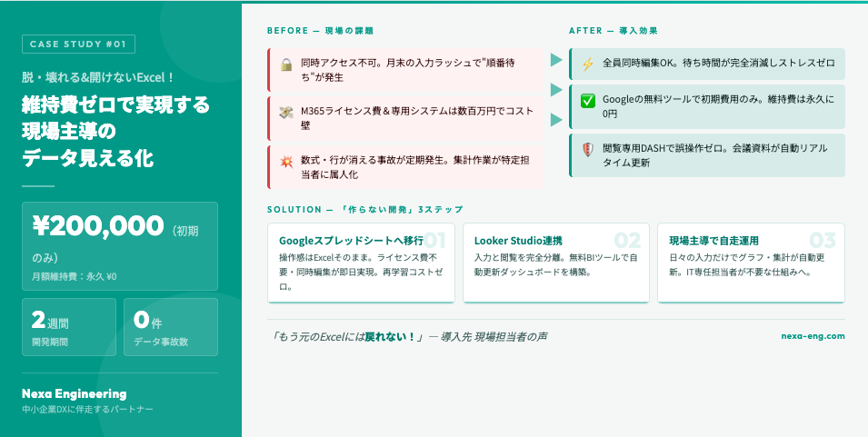
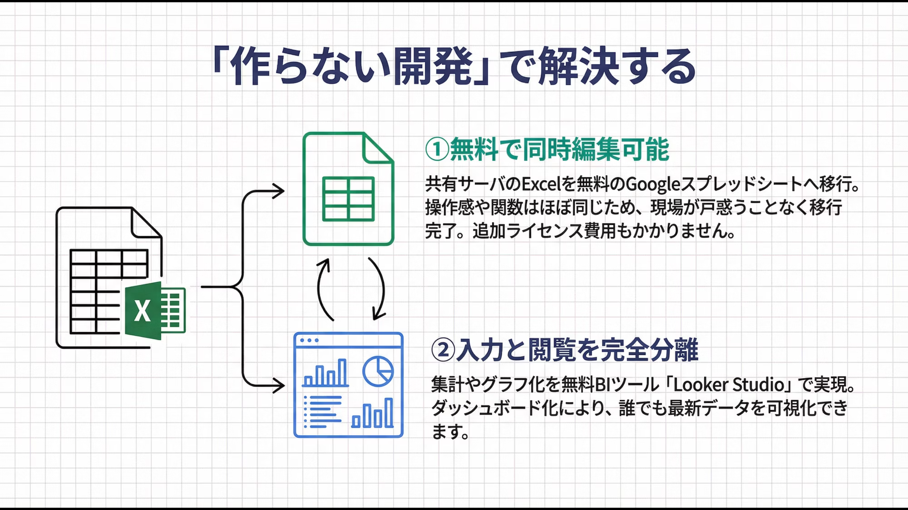

## 維持費ゼロで実現する、現場主導のデータ見える化

**「誰かがファイルを開いていて『読み取り専用』になり、作業が進まない…」**  
**「毎月の会議前、ピボットテーブルを作るだけで時間が溶けていく…」**  
**「誰かが数式を消してしまい、集計が合わなくなった…」**  

そんな「Excel管理の限界」を感じていませんか？
大掛かりなシステム開発を行わず、操作感はそのままに**初期費用20万円・維持費0円**で「絶対に壊れないリアルタイム・ダッシュボード」を構築した事例をご紹介します。

## 1. 現場のリアルな困りごと（Before）

あるお客様の現場では、原価や売掛買掛データを共有サーバ上の重たいExcelファイルで管理していました。そして以下のような課題に直面していました。

*   **「同時アクセスできない（順番待ちの発生）」**  
    共有サーバのExcelは複数人で同時に編集できず、月末の入力ラッシュ時には「誰かファイル閉じて！」という声が飛び交い、無駄な待ち時間が発生していました。
*   **「ライセンス費用とシステム化の壁」**  
    同時編集を行うために、Officeをクラウド対応の最新版（Microsoft 365等）へ一斉アップデートする案もありましたが、**「人数分の月額ライセンス費用」**がネックに。さらに、専用システムを開発すると数百万円かかるため、なかなか改善が進みませんでした。
*   **「ファイルが壊れる・集計が属人化」**  
    複数人で運用していた結果、誤って数式や行を消してしまう事故が定期的に発生。会議のたびに特定の手慣れた担当者がピボットテーブルやグラフを作り直す必要があり、多大な労力がかかっていました。

## 2. Nexa Engineeringの提案：「作らない開発」で解決する

Nexa Engineeringが提案したのは、高額な専用システムを作ることや、高いライセンス料を払い続けることではありませんでした。既存の無料ツールを賢く組み合わせる **「作らない開発」** です。

**① ライセンス費不要の「Googleスプレッドシート」へ移行**  
共有サーバのExcelをやめ、無料で同時編集が可能なGoogleスプレッドシートへデータを移行しました。 **シートの操作感や関数はこれまでのExcelとほぼ同じ** ため、現場が戸惑うことなく（再学習コストゼロで）スムーズに移行完了。もちろん、今後の追加ライセンス費用もかかりません。

**② 「入力」と「閲覧」の完全分離（Looker Studioの導入）**  
さらにここが最大のポイントです。集計やグラフ化をスプレッドシート上で行うのではなく、無料のBIツールである **「Looker Studio」** を連携させ、ダッシュボード化しました。

## 3. 導入効果：解決したら、こんなに簡単になった！（After）

システムを導入した結果、現場から **「圧倒的に楽になった！」「もう元のExcelには戻れない」** という声をいただきました。

*   💡 **サクサク動く！同時編集のストレスがゼロに** ：全員が同時にシートを開いて入力できるため、月末の業務集中時の「待ち時間」が消滅しました。
*   💡 **絶対に「壊れない」安心感** ：社長やマネージャは、Looker Studioのダッシュボードを「見るだけ」「フィルタで絞り込むだけ」。元データ（スプレッドシート）には一切触れないため、誤操作でデータや数式が壊れる事故が完全にゼロになりました。もしシートが壊れても自動バックアップ機能で簡単に戻せます。
*   💡 **会議の準備時間が激減** ：現場が日々入力するだけで、ダッシュボード上のグラフや集計表が自動で最新化。会議前の「資料作成・集計」という無駄な作業が消滅しました。

## 4. 費用と期間

特筆すべきはそのコストです。

*   **開発費用：約 200,000円**（※要件により変動します）
*   **月額維持費：0円**（Googleの無料枠・標準機能を活用するため、ランニングコストはかかりません）
*   **開発期間：約 2週間**

営業と開発者が同一であるNexa Engineeringだからこそ、お客様の悩みを聞いたその場で「それなら高いライセンス費用も、数百万円のシステムも不要です。Googleの機能で十分解決できます」と即座に判断できました。

製造現場で培った「ムダ取り」の精神で、貴社の業務に本当に必要な「小さな仕組み」を最短距離でお届けします。

## あなたの現場でも、同じ悩みを抱えていませんか？

「うちのExcelも限界かも…」「クラウド化って難しそう…」
そんなお悩みこそ、ぜひお気軽にご相談ください。現場に潜り込む専属エンジニアが、最適な解決策をご提案します。

[お問い合わせフォームへ](https://nexa-eng.com/contact/)