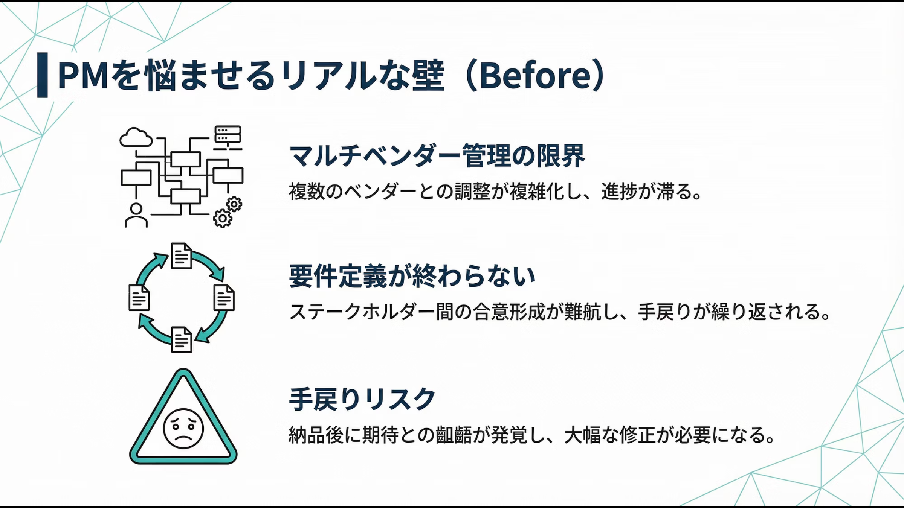
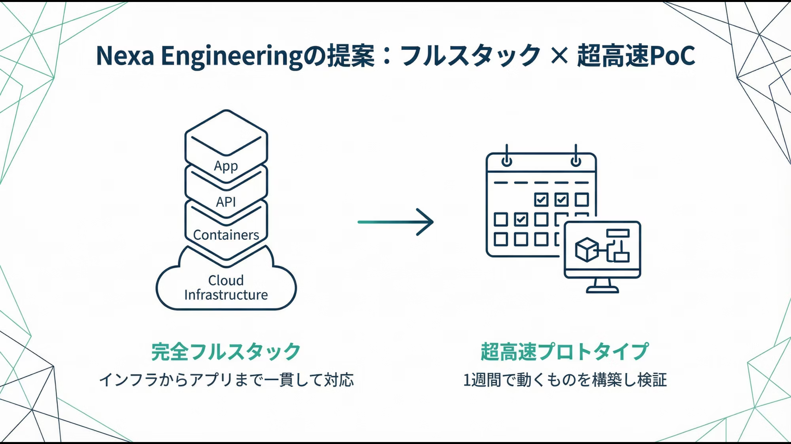
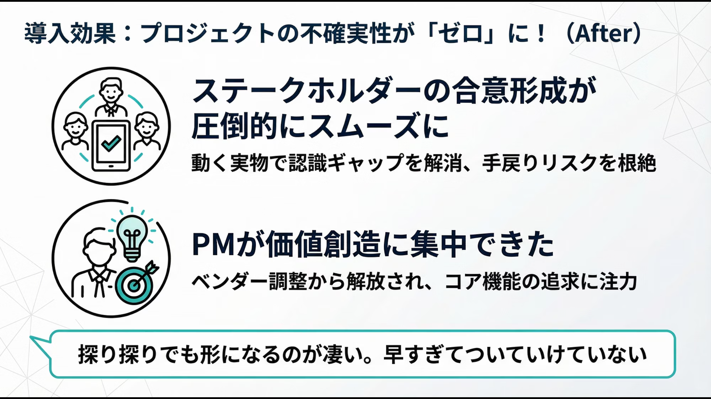

## 「要件定義」で止まっていませんか？

**「最新のAI技術（MCP等）を試したいが、インフラからアプリまで任せられるベンダーが見つからない…」**  
**「要件がフワッとしていて見積もりまで辿り着かず、プロジェクトが前に進まない…」**  
**「苦労して仕様書をまとめ上げたのに、完成品を見たユーザーに『思ってたのと違う』と言われた…」**  

そんな「不確実性の高いプロジェクト」のマネジメントに疲弊していませんか？  
分厚い仕様書づくりから脱却し、インフラからアプリまで丸ごと対応できる「専属エンジニア」の強みを活かして、**超短期でプロトタイプを構築・検証（PoC）した事例**をご紹介します。

## 1. PMを悩ませるリアルな壁（Before）

あるお客様は、AIが外部ツールと連携して自律的に動く最新技術「MCP（Model Context Protocol）」を活用したシステム構築を企画していました。しかし、プロジェクトマネージャーは以下の壁に直面していました。

*   **「マルチベンダー管理の限界」**  
    MCPサーバ構築にはクラウドインフラ（AWS等）、コンテナ（Docker）、API開発、AI知識と多岐にわたる技術が必要です。それぞれの専門業者をアサインし、要件をすり合わせる「ベンダーコントロール」の負荷がPMに重くのしかかっていました。
*   **「『要件定義』が終わらない」**  
    最新技術ゆえに「正解」が誰にもわからず、「調査しながら柔軟に進めたい」のが本音でした。しかし、一般的な開発会社は「仕様が固まらないと見積もれない」と平行線。プロジェクトが全く前に進まない状態でした。
*   **「『こんなはずじゃなかった』という手戻りリスク」**  
    過去のプロジェクトで、数ヶ月かけて仕様書を固めたにも関わらず、いざ完成すると現場から「求めていたものと違う」と突き返されるトラウマがあり、同じ失敗（手戻りによる予算・スケジュールの超過）を恐れていました。

## 2. Nexa Engineeringの提案：フルスタック × 超高速PoC

Nexa Engineeringが提案したのは、PMをドキュメント作成の呪縛から解放する「超高速PoC（概念実証）」です。

**① 「ベンダーコントロール」を不要にする完全フルスタック**  
一般的な開発ではインフラやアプリ内でも専門に応じて担当が分かれますが、Nexa Engineeringは **「クラウドインフラの構築からアプリの公開まで」** をトータルカバーします。各領域間の「伝言ゲーム」や「調整会議」がゼロになり、PMのマネジメント工数を極限まで削減しながら圧倒的なスピードで実装を進めます。

**② 仕様書の代わりに「プロトタイプ」でステークホルダーと合意する**  
要件定義に時間をかける代わりに、わずか1週間で「実際にAIと連携して動くプロトタイプ」を構築しました。これをステークホルダー（現場や経営層）に直接触ってもらうことで、「ここはもっとこうしたい」「この機能は不要」という直感的なフィードバックを引き出し、アジャイル（柔軟）に軌道修正しながらシステムを育てていきました。

## 3. スムーズな進捗とPM本来の価値へ集中（After）  

お客様のPMからは **「探り探りでも形になるのが凄い」「早すぎてついていけていない」** と、嬉しい悲鳴をいただきました。

*   💡 **ステークホルダーの「合意形成」が圧倒的にスムーズに**  
    早い段階から「動く実物」を触りながら仕様を固めていったため、現場との認識ギャップがなくなり、「こんなはずじゃなかった」という手戻りリスクを根絶できました。
*   💡 **PMの本来の仕事である「価値創造」に集中できた**  
    ベンダー間の調整や、意味のないドキュメント作成に追われることなく、無駄な機能（オーバーエンジニアリング）を削ぎ落とし、「本当に求めていたコア機能は何か」を突き詰めることに時間を注ぐことができました。

### 4. 費用と期間

特筆すべきは、未知の技術領域（R&D）でありながら、稟議を通しやすいこのスピードとコスト感です。

*   **開発費用（PoC構築）：約 300,000円〜** （※要件により変動します）
*   **開発期間：1週間（超短期）**

システム導入において、最も大きなコスト要因は「エンジニアの単価」ではありません。それは「伝言ゲーム（調整業務）」による意思決定の遅さと、多重請負構造による「過剰な開発（オーバーエンジニアリング）」です。
**「ご相談を受ける私」が「インフラを準備しコードを書く私」です。** 間に誰も挟まないからこそ、最新技術のプロジェクトでも、一緒に調査しながら形にしていくことが可能なのです。  
  
短期間で一気に「動く形」へ進め、その後必要に応じて改善を継続していきます。

## 💡 プロジェクトが前に進まず、お困りではありませんか？

「最新のAI技術を使ってみたいが、何から手をつけていいか分からない…」  
「どこの開発会社も予算があわないし専門ごとのフリーランスは管理が大変…」  
そんなPMの皆様、ぜひお気軽にご相談ください。インフラからアプリまで対応可能な貴社の「技術部門」として、アイデアを最速で「動く形」にします。

[ お問い合わせはこちら ](https://nexa-eng.com/contact/)