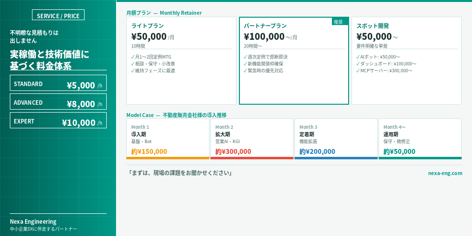

## Concept

**「外注」ではなく、「技術部門」とお考えください。**
**現場に潜り込み、貴社のビジネスを加速させる「専属エンジニア」**

Nexa Engineeringは、仕様書通りのシステムを作って終わるだけの開発会社ではありません。
工場現場で15年間培った「現場力」を活かし、貴社の業務フローの中に深く入り込みます。
「何が本当の課題か」を共に考え、最短距離で解決する「小さな仕組み」を高速で実装・改善し続けるパートナーです。

## Price Policy

**「不明瞭な見積もりは出しません」**

「何にいくらかかったか」を全てオープンにします。リスクヘッジのための過剰なバッファ（予備費）を積んだ一括見積もりではなく、 **「準委任契約」** をベースとした、 **実稼働と技術価値に基づく納得感のある料金体系** を提供します。

### 基本単価 (Hourly Rate)

扱う技術の難易度に応じて、3つの単価設定がございます。

| レベル | 目安単価（税別） | 対象領域・技術スタック |
| :--- | :--- | :--- |
| **Standard** | **¥5,000 / 時間** | **業務自動化・ツール設定** n8n, Looker Studio, LINE/Slackボット構築など、ローコードツールを中心とした開発。 |
| **Advanced** | **¥8,000 / 時間** | **アプリ開発・クラウド構築** AWS (Lambda/EC2), Python開発, Docker, API連携など、インフラ含めたフルスタック開発。 |
| **Expert** | **¥10,000 / 時間** | **AI研究開発・データサイエンス** LLMモデル構築, MCPサーバー開発, 予測モデル研究など、高度な専門性を要するR&D領域。 |

### 提供プラン (Service Plans)

月額プランとスポット開発を提供しています。いずれも柔軟に対応いたしますので一度ご相談下さい。

#### 月額プラン (Monthly Retainer)

**推奨**：「社内の技術部門」として、継続的に改善を回したい場合に。
月間の稼働枠を確保し、その中で「コンサルティング」「開発」「修正」を柔軟に行います。都度の見積もり承認フローが不要なため、圧倒的なスピードで改善が進みます。

| プラン名 | 月額目安 | 想定稼働 | 対象フェーズ |
| :--- | :--- | :--- | :--- |
| **ライトプラン** | **¥50,000** | 10時間 | **維持・相談メイン** ・月1〜2回の定例MTG (DXコンサル) ・チャット相談、小規模な改善、保守 |
| **パートナープラン** | **¥100,000〜** | 20時間〜 | **変革・開発メイン** ・週次定例MTGでの即断即決 ・新機能開発枠 ・緊急時の優先対応 |

※ 稼働時間はStandard単価ベースの目安です。Advanced ~ Expert領域の作業が含まれる場合は、時間換算レートを調整させていただきます。

#### スポット開発 (Project Based)

「この機能だけ欲しい」という明確な要件がある場合に。

*   **開発費用の目安（実績ベース）**
    *   LINE/Slack 業務AIボット: ¥50,000 〜
    *   商談文字起こし＆分析AI: ¥50,000 〜
    *   経営ダッシュボード構築: ¥100,000 〜
    *   MCPサーバー開発: ¥300,000 〜

## Model Case

**導入実績：不動産販売会社様**

最初の3ヶ月（パートナープラン相当）で集中的に開発を行い、システムが整った後はライトプランへ移行し、保守と改善を継続する事例です。

| フェーズ | 期間 | 実施内容の例 | 月額費用イメージ |
| :--- | :--- | :--- | :--- |
| **導入期** | Month 1 | **基盤構築・チャットボット導入** ・コンサルティング ・Slack/LINEチャットボットなど | **約 ¥150,000** |
| **拡大期** | Month 2 | **営業支援AI・見える化** ・商談分析AI ・経営KGIダッシュボード構築など | **約 ¥300,000** |
| **定着期** | Month 3 | **機能拡張・自動化深化** ・LINE秘書機能、広告分析ダッシュボードなど | **約 ¥200,000** |
| **運用期** | Month 4〜 | **保守・微修正** ・月数回の定例会議 ・既存ツールのチューニングや小改善 | **約 ¥50,000** |

※ 上記は請求実績に基づくモデルです。ご予算に合わせて「今月はここを重点的に」といった柔軟な調整が可能です。

### Contact

**「まずは、現場の課題をお聞かせください。」**

Nexa Engineeringは、小さな困りごとから、最先端の技術実装まで幅広く対応します。
「こんなことはできる？」といったご質問からでも、お気軽にご連絡ください。

[お問い合わせフォームへ](https://nexa-eng.com/contact/)